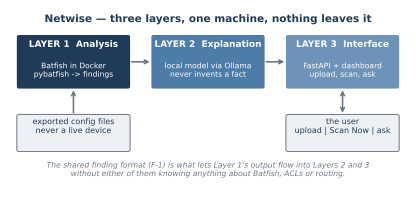
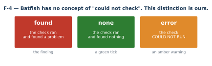
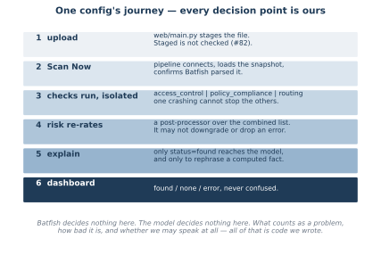

# Netwise — architecture

**Who this is for.** Anyone who needs to understand how Netwise fits together
without reading the code first: a new team member, a reviewer, or one of us in
six months. For *how to run it*, see [`user-guide.md`](user-guide.md).

This document exists because the repository had **no diagram of any kind**
until it was written. The figures had been built — they lived in a
gitignored build directory and reached people only inside a `.docx`. From the
repository's point of view, and from a reader's, they did not exist.

---

## 1. The three layers



| Layer | What it is | Where |
|---|---|---|
| **1 — Analysis** | Batfish in Docker, driven from Python. Turns config text into findings. | `analysis/` |
| **2 — Explanation** | A local model via Ollama. Rephrases findings; never invents one. | `ai/` |
| **3 — Interface** | FastAPI plus a small dashboard. Upload, Scan Now, ask a question. | `web/` |

The arrows are one-directional and that is deliberate: `analysis` imports
nothing above it, `ai` imports `analysis`, `web` imports both. Nothing lower
knows the layers above exist.

**Everything runs on one machine.** No config data reaches any cloud service.
Netwise reads exported files and never connects to, scans, or modifies a live
device — a property it inherits from Batfish, which structurally cannot.

---

## 2. F-4 — the rule the whole product rests on



Every finding carries a `status`, and it is always exactly one of three
values.

**`none` and `error` must never look alike.** "We checked and it is fine" and
"we could not check" are different claims, and a security tool that confuses
them can tell somebody they are safe when nobody looked.

Batfish has no concept of "could not check" — it answers or it raises. This
distinction is ours, and it is enforced in more places than any other rule in
the project:

- every check isolates each sub-analysis, so one failing query cannot swallow
  the others
- `pipeline.run_post_processors()` **structurally forbids** a post-processor
  from downgrading or dropping a `status="error"` finding — checked in code,
  not merely documented
- `analysis/snapshot.py` returns `None` ("could not find out") as a genuinely
  different value from an empty set ("found out, nothing there")
- the AI layer refuses to write prose for an `error` finding at all

---

## 3. F-1 — the shared finding format

Every check returns a list of dictionaries in exactly this shape:

```python
{
    "id": "AC-002",
    "check": "access_control",
    "severity": "high",
    "device": "rtr-us5",
    "summary": "One line, plain English, no jargon",
    "evidence": {"detail": "...", "source": "..."},
    "status": "found",
}
```

This is what makes the system composable. The explanation layer, the
dashboard and the risk post-processor were each written against this **one**
shape, and none of them needs to know anything about Batfish, ACLs or routing.

The contract is [`finding-format.md`](finding-format.md). Changing it needs
all four team members to agree again — the same governance a real API
contract gets.

---

## 4. F-3 — the three ways a feature can plug in

| Shape | Signature | Registered in | Example |
|---|---|---|---|
| **Producer** | `run(bf) -> list[dict]` | `CHECKS` | `access_control`, `policy_compliance`, `routing` |
| **Post-processor** | `refine(results) -> results` | `POST_PROCESSORS` | `risk` |
| **Separate entry point** | `analyse_change(before, after)` | *neither* | `change_impact` |

`change_impact` needs **two** snapshots, so it cannot satisfy `run(bf)`. It is
a separate entry point on purpose, and both its module docstring and the
registry comment say so. See
[`design/pipeline-feature-shapes.md`](design/pipeline-feature-shapes.md),
adopted by all four signatures.

---

## 5. One config's journey



The pipeline (`analysis/pipeline.py`) does five distinct jobs, in order, every
time:

1. **Connect** to Batfish, with a fast port probe first — a stopped container
   fails in about two seconds rather than hanging for a minute.
2. **Load** the uploaded folder as a snapshot.
3. **Confirm Batfish understood it.** If any file only partially parsed, the
   analysis stops rather than silently running on a config it half-read.
4. **Run every registered check, isolated.** If `routing.py` crashes,
   `access_control` and `policy_compliance` still run and report normally.
5. **Post-process** the combined list — currently `risk`, re-rating severity
   and sorting worst-first.

Each of those five can fail on its own, and each failure produces an honest
finding rather than a crash or a blank screen.

---

## 6. What is ours, and what is not

Worth stating plainly, because it is the question this project gets asked
most.

**Batfish gives you:** a parser for vendor config syntax, a vendor-neutral
model of a network, and a fixed set of questions you can ask it. It is a
calculator. It does not know what a security policy is, which question is
worth asking, how bad an answer is, or how to say it to a person. It cannot
read PF Sense at all.

**Ours:**

| | Where |
|---|---|
| The PF Sense → Cisco translator, built from nothing | `analysis/pfsense_convert.py` |
| Choosing `searchFilters` over `reachability` — on a config containing `permit ip any any`, the obvious question reports **zero problems** | `docs/policy-rules.md` |
| The `found` / `none` / `error` distinction, and everything enforcing it | everywhere |
| The finding contract and the three feature shapes | `docs/finding-format.md`, `design/pipeline-feature-shapes.md` |
| Grounding the model so it cannot state a false fact about a network | `ai/explain.py`, `ai/query.py` |
| Refusing rather than guessing — a wrong answer is worse than none | `pfsense_convert.py`, `ai/query.py`, `ai/propose.py` |
| The severity model | `analysis/checks/risk.py`, `docs/severity-rules.md` |

---

## 7. Regenerating the diagrams

```bash
python -m tools.make_diagrams      # either form works
python tools/make_diagrams.py
```

The figures are SVG on purpose: text, so git can diff them, and sharp at any
size. They are **generated rather than drawn**, so they cannot drift from a
hand-edit nobody remembers making.

If a layer or a rule changes, edit `tools/make_diagrams.py` and re-run it —
never edit the SVG. A diagram nobody can regenerate is the same problem as a
number nobody can re-measure.
